# 🏗️ System Architecture

This document details the technical design of the **Pikachu Desktop Assistant**. The system follows a modular **Cognitive Architecture**, separating Input (Senses), Processing (Brain), and Output (Muscles) into distinct, loosely coupled Python modules.

---

## 🔄 High-Level Data Flow

The system operates on a linear **Input → Process → Execute** loop.

```mermaid
sequenceDiagram
    participant User
    participant Listener as 👂 Listener (Senses)
    participant Memory as 🧠 Memory (Context)
    participant Brain as ⚡ Brain (LLM)
    participant Muscles as 💪 Muscles (Execution)
    
    User->>Listener: "Open Chrome"
    Listener->>Brain: Text Input ("open chrome")
    Brain->>Memory: Fetch Context (Last App, User Prefs)
    Memory-->>Brain: Context String
    Brain->>Brain: Prompt Engineering + Safety Overrides
    Brain->>Brain: LLM Inference (Qwen 2.5)
    Brain-->>Muscles: JSON Command {"action": "open_app", "name": "chrome"}
    Muscles->>User: Execute Action (Open App)
    Muscles-->>Listener: Status ("Done")
    Listener->>User: TTS Feedback ("Opening Chrome...")
```



---

## 🧩 Core Modules

### 1. 👂 The Senses (Input Layer)

The system has two primary input methods that run in parallel or independently.

#### **Voice Listener** (`listener.py`)

- **Wake Word Detection**: Runs a continuous loop listening for triggers defined in `WAKE_WORDS` (e.g., "Pikachu", "Hey You")
- **Speech-to-Text (STT)**: Uses `speech_recognition` (Google Web API) to convert audio to text
- **State Management**: Currently operates on a blocking loop:
  1. Listen for Wake Word
  2. Listen for Command
  3. Pass to Brain

**Technology Stack:**
- `speech_recognition` - Audio capture and STT
- `pyttsx3` - Text-to-Speech feedback
- Blocking I/O model (planned migration to async FSM)

#### **Telegram Bot** (`tele_agent.py`)

- **Async Polling**: Uses `python-telegram-bot` with `asyncio` to poll for messages
- **Remote Bridge**: Allows text commands, photo uploads, and button interactions to trigger the same `brain.py` logic as voice commands
- **Live Feed**: Capable of streaming webcam frames via an async loop (`camera_monitor_loop`)

**Technology Stack:**
- `python-telegram-bot` - Bot framework
- `asyncio` - Asynchronous event loop
- OpenCV integration for camera streaming

---

### 2. ⚡ The Brain (Cognition Layer)

Located in `brain.py`, this module is responsible for **intent classification** and **decision making**.

#### **LLM Backend**
- Connects to a local **Ollama** instance running `qwen2.5-coder:7b`
- Endpoint: `localhost:11434`
- Zero external API calls - fully offline AI

#### **Prompt Engineering**
Wraps user input in a strict system prompt (`BASE_SYSTEM_PROMPT`) that forces the model to output **valid JSON only**.

**Example System Prompt Structure:**
```
You are Pikachu, a desktop assistant. 
You must respond ONLY with valid JSON.
Available actions: [open_app, close_app, camera_stream, ...]
Context: {memory.get_context_string()}
```

#### **Context Injection**
Calls `memory.get_context_string()` to inject short-term history (e.g., "Last App Opened") into the prompt before inference.

#### **Safety Net (Paranoid Overrides)**

Before trusting the LLM's output, the system runs raw **Regex checks** on the user input.

**Example:**
```python
if "camera" in user_input.lower() and "on" in user_input.lower():
    # Force override to prevent hallucination
    return {"action": "camera_stream", "value": "on"}
```

This prevents the model from misinterpreting critical commands.

---

### 3. 💪 The Muscles (Execution Layer)

Located in `muscles.py`, this module translates **abstract JSON intents** into **low-level Windows API calls**.

| Intent | Technology Used | Description |
|--------|----------------|-------------|
| **App Control** | `os.system`, `taskkill` | Force closes apps or launches `.exe` files |
| **Navigation** | `pyautogui` | Simulates 'Win' key presses and typing |
| **Vision** | `opencv-python` (`cv2`) | Captures frames from webcam index 0 or 1 |
| **System Info** | `psutil` | Reads battery sensors, CPU load, and RAM usage |
| **File I/O** | `shutil`, `os` | Recursive search for browsers; file listing |

#### **Example Capabilities:**

**App Control:**
```python
def open_app(app_name):
    os.startfile(f"C:/Program Files/{app_name}.exe")
```

**System Monitoring:**
```python
def get_battery():
    battery = psutil.sensors_battery()
    return f"{battery.percent}% ({'Charging' if battery.power_plugged else 'Discharging'})"
```

**Camera Stream:**
```python
def start_camera():
    cap = cv2.VideoCapture(0)
    # Stream frames to Telegram or display
```

---

### 4. 🧠 Memory (State Layer)

Located in `memory.py`, this acts as the bridge between **past actions** and **current decisions**.

#### **Short-Term Memory (RAM)**
- Stores the immediate context of the session:
  - `last_app_opened`
  - `last_browser_used`
  - `camera_state`
- **Volatile**: Resets on restart

#### **Long-Term Memory (JSON)**
- Persists user preferences to `long_term_memory.json`
  - User Name
  - Favorite Apps
  - Custom Shortcuts
- **Persistent**: Survives restarts

#### **Retrieval Function**

```python
def get_context_string():
    """
    Formats memory into a text block for LLM injection.
    Example Output:
    ---
    Last App Opened: Chrome
    User Name: Alex
    Camera Status: Off
    ---
    """
    return formatted_context
```

---

## 📂 Directory Structure & Key Files

```bash
pikachu-assistant/
├── .env                    # Configuration (Tokens, Model Name)
├── brain.py                # LLM Interaction & Logic
├── muscles.py              # System Automation Scripts
├── listener.py             # Voice Recognition Loop
├── memory.py               # JSON Data Store
├── tele_agent.py           # Telegram Interface
├── main.py                 # Voice Mode Entry Point
├── run_silent.vbs          # Stealth Launcher (Windows)
└── long_term_memory.json   # Persistent User Data
```

### **File Descriptions**

| File | Purpose |
|------|---------|
| **`.env`** | Stores API tokens (Telegram Bot Token), model configuration, and environment variables |
| **`brain.py`** | Core AI logic - interfaces with Ollama LLM and applies safety overrides |
| **`muscles.py`** | System execution layer - all OS interactions happen here |
| **`listener.py`** | Voice input handler - wake word detection + STT processing |
| **`memory.py`** | State management - short-term (runtime) and long-term (JSON) storage |
| **`tele_agent.py`** | Telegram bot interface - async message handling and camera streaming |
| **`main.py`** | Entry point for voice mode - starts the listener loop |
| **`run_silent.vbs`** | Windows VBScript to launch the assistant without a console window |

---

## 🛡️ Security & Permissions

### **Privacy by Design**

✅ **Local Execution**: The AI model runs entirely on `localhost:11434` (Ollama). **No audio or text is sent to third-party AI clouds.**

### **Current Permissions**

⚠️ **File Access**: The bot currently has **read/write access** to the user's file system for the `send_file` and `list_files` capabilities.

⚠️ **Process Control**: The `close_app` function uses `taskkill /f`, which forces processes to terminate **without saving**.

### **Recommended Safeguards**

1. **Sandboxing**: Restrict file operations to a whitelist of directories
2. **Confirmation Dialogs**: Require user approval for destructive actions
3. **Audit Logging**: Log all system-level commands to a secure file

---

## 🚀 Future Architecture Goals (v2.0)

### **1. State Machine Implementation**

**Current Issue**: The listener operates on a blocking loop, which can cause self-triggering when TTS feedback contains wake words.

**Proposed Solution**: Implement a **Finite State Machine (FSM)** in `listener.py`:

```python
States:
- IDLE (Waiting for wake word)
- LISTENING (Recording user command)
- PROCESSING (Brain inference)
- EXECUTING (Muscles running)
- SPEAKING (TTS active - wake word detection disabled)
```

---

### **2. RAG Implementation (Retrieval Augmented Generation)**

**Current Limitation**: The entire memory context is dumped as a raw string into the LLM prompt, which doesn't scale beyond ~50 interactions.

**Proposed Solution**: Replace JSON memory with a **Vector Store**:

- **Embedding Model**: `sentence-transformers/all-MiniLM-L6-v2`
- **Vector DB**: ChromaDB or FAISS
- **Workflow**:
  1. Each user interaction is embedded and stored
  2. On new query, retrieve top-k relevant memories
  3. Inject only relevant context into the prompt

**Benefits**:
- Scales to thousands of interactions
- Semantic search (e.g., "What did I ask about Chrome last week?")
- Reduces token usage in prompts

---

### **3. Tool Gating (Human-in-the-Loop)**

**Current Risk**: The system can execute destructive commands (e.g., `taskkill`, file deletion) without confirmation.

**Proposed Solution**: Add a **confirmation layer** for high-risk actions:

```python
GATED_ACTIONS = ["close_app", "delete_file", "shutdown"]

def execute_with_confirmation(action, params):
    if action in GATED_ACTIONS:
        # Send confirmation request to Telegram
        if not await user_approves(action, params):
            return "Action cancelled by user"
    
    return muscles.execute(action, params)
```

**Implementation Options**:
- Telegram inline buttons ("Confirm" / "Cancel")
- Voice confirmation ("Say YES to confirm")
- Time-bound approval window (30 seconds)

---

### **4. Multi-Modal Input Fusion**

**Goal**: Allow the assistant to process voice, text, and vision simultaneously.

**Example Use Case**:
- User sends a photo via Telegram
- User says: "What's in this image?"
- System uses a vision model (e.g., LLaVA) to describe the photo

**Required Components**:
- Vision-Language Model integration (Ollama supports `llava:7b`)
- Unified input queue that merges voice, text, and image streams

---

### **5. Plugin Architecture**

**Current Issue**: Adding new capabilities requires editing `muscles.py` directly.

**Proposed Solution**: Create a **plugin system**:

```python
# plugins/spotify_control.py
class SpotifyPlugin:
    def get_actions(self):
        return ["play_song", "pause_music", "next_track"]
    
    def execute(self, action, params):
        # Spotify API calls
        pass

# brain.py dynamically loads plugins
available_actions = load_all_plugins()
```

**Benefits**:
- Community contributions via plugins
- Easier to maintain and test
- No need to restart the assistant when adding features

---

## 📊 System Requirements

### **Minimum Specifications**
- **OS**: Windows 10/11 (Linux/Mac support planned)
- **RAM**: 8GB (16GB recommended for LLM)
- **Storage**: 10GB free (for Ollama models)
- **Network**: Internet required for Telegram bot (optional for voice-only mode)

### **Software Dependencies**

**Core:**
- Python 3.9+
- Ollama (with `qwen2.5-coder:7b` model)

**Python Packages:**
```
speech_recognition
pyttsx3
python-telegram-bot
opencv-python
psutil
pyautogui
python-dotenv
```

---

## 🐛 Known Limitations

1. **Windows-Only**: Process control and system commands are Windows-specific
2. **Single User**: No multi-user support or permission system
3. **No Cloud Sync**: Memory is local to the machine
4. **Limited Error Recovery**: If Ollama crashes, the assistant freezes
5. **Wake Word False Positives**: Can trigger on similar-sounding words

---

## 📝 Version History

| Version | Date | Changes |
|---------|------|---------|
| **v1.0** | 2024-01 | Initial release with voice and Telegram support |
| **v1.1** | 2024-02 | Added camera streaming and file management |
| **v2.0** | TBD | Planned: FSM, RAG, Tool Gating |

---

## 🤝 Contributing

This is a modular system - contributions are welcome! Focus areas:

1. **New Muscles**: Add capabilities to `muscles.py` (e.g., Spotify control, smart home)
2. **Better Prompts**: Improve `BASE_SYSTEM_PROMPT` in `brain.py`
3. **Platform Support**: Port Windows-specific code to Linux/Mac
4. **Security Audits**: Review file access and process control logic

---

## 📄 License

This project is distributed under the MIT License. See `LICENSE` file for details.

---

**Built with ❤️ for privacy-conscious desktop automation**
